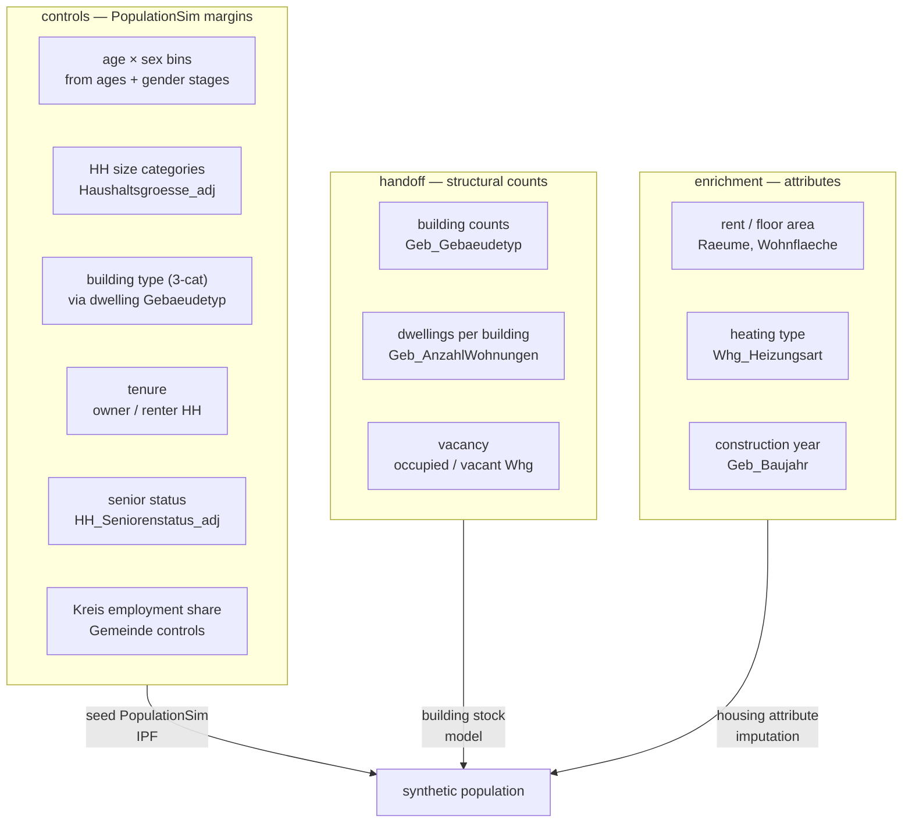

```mermaid
flowchart LR
    subgraph RI["raw ingest"]
        M["merge<br/>z22data parquets<br/>→ wide tables<br/>10 km / 1 km / 100 m"]
        T["totals<br/>collapse POP_TOTAL<br/>cross-level adjust"]
        A["ages<br/>AGE_0..100<br/>trust-mixed IPF"]
    end
    subgraph H["harmonize"]
        G4["gemeinde<br/>VG250 spatial join<br/>ARS / Land / Kreis"]
        G5["gender<br/>M-F split<br/>36-row backfill"]
        T8["topics8<br/>8 original topics<br/>10 km → 1 km → 100 m"]
        AG["aggs<br/>decade-binned<br/>gendered ages"]
        RS["regiostar<br/>BBSR RegioStaR 2022<br/>null-rim 5 188 → 633"]
        EX["extend<br/>additional topics<br/>stage_a 10 km→1 km<br/>stage_b 1 km→100 m"]
    end
    subgraph DV["derive & validate"]
        TEN["tenure<br/>owner / renter HH<br/>from Eigentuemerquote"]
        VAC["vacancy<br/>occupied / vacant Whg<br/>from Leerstandsquote"]
        SAN["sanity<br/>0 failures<br/>5 invariants"]
    end
    M --> T --> A --> G4 --> G5 --> T8 --> AG --> RS --> EX
    EX --> TEN --> VAC --> SAN
    SAN --> O1["zensus2022_grid_1km_de_v2.parquet<br/>212 758 cells"]
    SAN --> O100["zensus2022_grid_100m_de_v2.parquet<br/>3 148 482 cells"]
```

# cleancensus

**Analysis-ready German Zensus 2022 grid data at 100 m / 1 km / 10 km** — a reproducible
12-stage pipeline that resolves disclosure perturbation, harmonizes categorical topics across
resolutions, and derives tenure and vacancy — producing consistent, zero-sanity-failure cell
tables for synthetic-population generation.

[](#validated-reference-results)
[](LICENSE)
[](pyproject.toml)
[](https://doi.org/10.1016/j.procs.2026.04.122)
[](#data)



---

## 📋 The problem

The Zensus 2022 grid release applies cell-level **disclosure control**: each cell's category
counts are independently perturbed before publication. As a result, the sum of categories
within a cell does not equal the published cell total, and the same universe measured at
100 m, 1 km, and 10 km gives three inconsistent values for the same spatial extent.

Any downstream model that ingests these tables raw will work with contradictory marginals,
produce IPF infeasibilities, or silently accumulate rounding errors.

The following toy example illustrates the problem for a single cell:

| Column | Raw published value |
|---|---|
| Total households (`Insgesamt`) | 25 |
| 1-person households | 8 |
| 2-person households | 5 |
| 3-person households | 4 |
| 4-person households | 3 |
| 5-person households | 2 |
| **Sum of categories** | **22** |

`sum(categories) = 22 ≠ 25 = Insgesamt` — the discrepancy is the disclosure perturbation.
cleancensus resolves this with trust-blended IPF: the 10 km totals serve as trusted anchors;
fine-resolution cell distributions are adjusted so categories sum exactly to the corrected
total at every resolution.

---

## ⚡ Quickstart

```bash
# 0. Install uv (https://docs.astral.sh/uv/getting-started/installation/) and clone this repo.

# 1. Install dependencies (Python 3.13+ required)
uv sync

# 2. Copy and edit the example config
cp config.example.toml config.toml

# 3. Preview the resolved plan without running anything
uv run cleancensus --config config.toml --dry-run

# 4. Run
uv run cleancensus --config config.toml
```

There are two entry modes depending on what data you have:

### (a) Prepared mode — fastest, default

Place the three pre-processed input files in `data/inputs/` (see [**Data**](#data) below for
file names). Only **extend**, **tenure**, **vacancy** (optional), and **sanity** run — the
raw→prepared chain is skipped. This is what `config.example.toml` enables by default.

**Hardware:** the 100 m stage streams the 7.7 GB input in 1 M-row batches; peak RAM ~4–6 GB;
a national run with the 2 default topics + tenure takes approximately 2–4 h on a desktop CPU.

### (b) Full mode — raw→final (all 12 stages)

Enable all producer stages to run from the raw z22data Parquet files (downloaded
automatically by the merge stage):

```toml
# config_full.toml
[data]
inputs_dir  = "data/inputs"
outputs_dir = "data/outputs"
version_tag = "v2"

[harmonize]
topics         = ["Whg_Gebaeudetyp", "HH_Seniorenstatus"]
derived_tenure = true

[scope]
mode = "national"

[run]
sanity        = "fail"
write_manifest = true

[stages]
merge     = true   # download z22data parquets + build wide tables
totals    = true   # collapse POP_TOTAL + cross-level adjustment
ages      = true   # AGE_0..100 via trust-mixed IPF
gemeinde  = true   # VG250 spatial join (requires BKG GeoPackage)
gender    = true   # M/F split (requires GENESIS 1000A-2027 CSV)
topics8   = true   # 8 original categorical topics 10 km → 1 km → 100 m
aggs      = true   # decade-binned gendered age aggregates
regiostar = true   # BBSR RegioStaR 2022 join (requires referenzdatei.xlsx)
extend    = true   # additional harmonized topics from catalog
```

Two external files are required for the `gemeinde` and `gender` stages:

| File | Where to get it | Config key |
|---|---|---|
| GENESIS `1000A-2027_de.csv` (population by age and sex at Gemeinde level) | [ergebnisse.zensus2022.de → table 1000A-2027](https://ergebnisse.zensus2022.de/datenbank/online/table/1000A-2027) → Anpassen → Gemeinden → CSV | `gemeinde_age_csv_path` |
| BKG VG250 GeoPackage `DE_VG250.gpkg` (ref date 2022-01-01, EPSG:25832) | [gdz.bkg.bund.de](https://gdz.bkg.bund.de/index.php/default/open-data/verwaltungsgebiete-1-250-000-mit-einwohnerzahlen-stand-31-12-vg250-ew-31-12.html) | `vg250_gpkg_path` |

> **Per-stage E2E status:** all 12 stage gates passed (see [Validated reference results](#validated-reference-results)). A full-chain national run is currently in final validation.

---

## 🗂️ Data universes

The Zensus 2022 grid distributes attributes across **six distinct universes**. Topics from
different universes cannot be anchored against each other — the pipeline enforces this rule.

| Universe | National total | Example topics |
|---|---|---|
| Personen | ~82.7 M (`POP_TOTAL_adj`) | Familienstand, Geburtsland, Staatsangehoerigkeit, Religion |
| Haushalte | ~40.2 M | Haushaltsgroesse, Lebensform, HH_Seniorenstatus, HH_Familientyp, Tenure |
| Familien | 21.7 M | Fam_Groesse, Fam_TypNachKindern |
| Gebäude | 19.96 M | Geb_Gebaeudetyp, Geb_AnzahlWohnungen, Geb_Baujahr, Geb_Energietraeger |
| Wohnungen A (Räume / Fläche) | 41.2 M | Raeume, Wohnflaeche |
| Wohnungen B (Gebäudetyp / Heizung) | 42.5 M | Whg_Gebaeudetyp, Whg_Heizungsart |

> Wohnungen A and B are separate cross-tabulations of the same dwelling stock and must not be
> mixed in the same IPF run.

---

## 📊 Validated reference results

All raw→prepared stages are **equivalence-gated** against the notebook-era T: drive artifacts.
Per-stage gates all passed; the full-chain national E2E run is in final validation.

### Gate scoreboard

| Stage | Gate metric | Result |
|---|---|---|
| **merge** — z22 10 km | 157 / 158 shared columns EXACT; 1 near-exact (households total −0.018%, disclosure revision) | ✅ PASS |
| **merge** — z22 1 km | 158 / 159 shared columns EXACT; 1 systematic (cell-level suppression, not a port bug) | ✅ PASS |
| **merge** — Destatis supplement | 33 / 33 columns EXACT at 10 km and 1 km; +14 / 14 columns for Typ_der_Kernfamilie_nach_Kindern | ✅ PASS |
| **merge** — Destatis totals | 15 / 15 new Insgesamt columns EXACT at 10 km and 1 km | ✅ PASS |
| **totals** | 10 km: exact; 1 km: max\|d\| = 3.6e-12 | ✅ PASS |
| **ages** | 10 km exact; 1 km exact (212 758 cells); 100 m exact (54-cell subset) | ✅ PASS |
| **gemeinde** | ARS sub-field transform verified on 100 unique ARS; T: artifact row count confirmed (3 148 224) | ✅ PASS |
| **gender** | Bavaria subset (575 875 rows): column sums rel diff < 2.4e-6 (float32 noise); backfill 36 / 36 rows exact | ✅ PASS |
| **topics8** | 1 km max\|d\| = 0; ZGB 78 / 82 exact + 1 benign orphan cell | ✅ PASS |
| **aggs** | Gendered bins exact zero diff; AGE_\* float noise ~1e-7 (M+F summation) | ✅ PASS |
| **regiostar** | Null-rim cells: 5 188 → 633 (−4 555); match rate ≥ 99.97% vs BMDV 2020 | ✅ PASS |
| **extend** | ZGB equivalence gate max\|d\| = 3.05e-05 (float32 noise); raw totals bit-exact | ✅ PASS |
| **tenure** | National owner share 0.4419 (official Zensus 2022 ≈ 0.436); 4 orphan cells deviate ≤ 3 HH (benign) | ✅ PASS |
| **vacancy** | National signal rate 4.26% (official Zensus 2022 ≈ 4.3%); anchored to universe A; 0 sanity failures | ✅ PASS |
| **sanity** | 0 failures across all 5 invariants; 3 148 482 cells | ✅ PASS |

### End-to-end output numbers

Topics = `["Whg_Gebaeudetyp", "HH_Seniorenstatus"]`, `derived_tenure = true`.

| Metric | Value |
|---|---|
| 100 m output rows | 3 148 482 |
| 1 km output rows | 212 758 |
| Sanity failures | 0 |
| `sum(categories) == *_adj` per cell | exact (max \|d\| < 0.5) |
| `Seniorenstatus_adj == HH-Groesse_adj` per cell | exact |
| National mass relative deviation | 0.0001 |
| National owner share (Eigentuemerquote) | 0.4419 (official ≈ 0.436) |
| National vacancy signal rate (Leerstandsquote) | 4.26% (official ≈ 4.3%) |
| ZGB equivalence gate worst max\|d\| | 3.05e-05 (float32 noise) |
| ZGB raw totals vs legacy | bit-exact |
| 1 km cells filled from 10 km group mean (tenure) | 12 086 |
| 100 m no-signal cells filled from parent share (tenure) | 471 752 |

<details>
<summary>Full stage descriptions</summary>

| # | Stage | Description |
|---|---|---|
| 1 | **merge** | Downloads z22data Parquet files (Jonas Lieth's GitHub mirror, 160 files) and assembles wide per-level tables at 10 km, 1 km, and 100 m; all 36 feature families mapped (160 FEATURE_MAP entries); ingests Destatis-CSV supplement (7 tables). |
| 2 | **totals** | Consensus-collapses population total columns and proportionally adjusts child sums to match parent totals across 10 km → 1 km → 100 m. |
| 3 | **ages** | Fits single-year age columns AGE_0..AGE_100 via trust-mixed multiplicative IPF on the 10 km grid (trust_local = 0.99, outer_iters = 10, inner_passes = 30), then hierarchically downscales to 1 km and 100 m. |
| 4 | **gemeinde** | Spatial join of BKG VG250 Gemeinde polygons (EPSG:25832 → 3035) onto 100 m cell centroids; attaches ARS-derived sub-fields (Land, Kreis, Gemeinde). |
| 5 | **gender** | Male/female age split at 100 m using GENESIS 1000A-2027 per-Gemeinde shares; orphan-cell backfill for 36 cells with population but no age breakdown. |
| 6 | **topics8** | Trust-blended IPF downscaling of the 8 original categorical topics (Familienstand, Energietraeger, Heizungsart, HH-Groesse, Lebensform, Raeume, Wohnflaeche, Geburtsland) from 10 km → 1 km → 100 m; orphan pass inline. |
| 7 | **aggs** | Decade-binned gendered age aggregates (M_AGE_0_9_agg … F_AGE_80_plus_agg) and undifferentiated AGE_*_agg columns. |
| 8 | **regiostar** | Joins 7 BBSR RegioStaR 2022 classification columns onto 100 m cells via 8-digit AGS derived from the ARS key. Uses BBSR Gebietsstand 31.12.2022 (10 990 Gemeinden). |
| 9 | **extend** | Harmonizes additional topics from the catalog (see Topic catalog below) at 10 km → 1 km (stage_a) and 1 km → 100 m streamed (stage_b); controlled by `[harmonize].topics`. |
| 10 | **tenure** *(optional)* | Derives owner/renter household counts from `Eigentuemerquote`, anchored to the harmonized household total chain; fills from 10 km group mean or national mean for cells without a local signal. |
| 11 | **vacancy** *(optional)* | Derives occupied/vacant dwelling counts from `Leerstandsquote`; adds `BewohntWhg_*` + `LeerstehendWhg_*`; anchored to universe A (~41.8 M dwellings). |
| 12 | **sanity** | Invariant checks: `sum(categories) == *_adj` per cell; universe equality; national mass within 2% of 10 km raw total; no NaN / negatives. |

</details>

<details>
<summary>Gate report links</summary>

| Report | Content |
|---|---|
| [`docs/Z22_GATE_REPORT.md`](docs/Z22_GATE_REPORT.md) | z22data ingest validation: GITTER_ID formula, 10 km / 1 km gates, Destatis supplement, vacancy |
| [`docs/AGES_GATE_REPORT.md`](docs/AGES_GATE_REPORT.md) | Totals and ages stage gates |
| [`docs/GENDER_GATE_REPORT.md`](docs/GENDER_GATE_REPORT.md) | Gemeinde and gender stage gates, RegioStaR gate |

</details>

---

## 🗺️ Census attribute roles



---

## 📚 Topic catalog

14 additional topics across 3 tiers, controlled by `[harmonize].topics` or `[harmonize].tiers`:

| Tier | Topic name | Categories | Universe | MiD default |
|---|---|---|---|---|
| 1 | `Geb_Gebaeudetyp` | 10 | Gebäude | — |
| 1 | `Geb_AnzahlWohnungen` | 5 | Gebäude | — |
| 1 | `Geb_Baujahr` | 8 | Gebäude | — |
| 1 | `Geb_Energietraeger` | 9 | Gebäude | — |
| 1 | `Whg_Gebaeudetyp` | 10 | Wohnungen B | ✓ |
| 1 | `Whg_Heizungsart` | 6 | Wohnungen B | — |
| 2 | `HH_Seniorenstatus` | 3 | Haushalte | ✓ |
| 2 | `HH_Familientyp` | 5 | Haushalte | — |
| 2 | `Pers_Staatsangehoerigkeit` | 2 | Personen | — |
| 3 | `Pers_StaatsangGruppen` | 6 | Personen | — |
| 3 | `Pers_ZahlStaatsang` | 4 | Personen | — |
| 3 | `Pers_Religion` | 3 | Personen | — |
| 3 | `Fam_Groesse` | 5 | Familien | — |
| 3 | `Fam_TypNachKindern` | 13 | Familien | — |

The MiD default (`["Whg_Gebaeudetyp", "HH_Seniorenstatus"]`) is the set of Zensus attributes
that the MiD 2023 household travel survey can directly serve as PopulationSim controls for:
building type via the geocoded `haustyp` variable and senior status via household member ages.

---

## ⚙️ Config quick-reference

Full documentation: [`docs/CONFIG.md`](docs/CONFIG.md).

| Section | Key | Type | Default | Effect |
|---|---|---|---|---|
| `[data]` | `inputs_dir` | path | `"data/inputs"` | Three canonical input files or work_dir artifacts |
| `[data]` | `outputs_dir` | path | `"data/outputs"` | Destination for versioned output parquets and run manifest |
| `[data]` | `version_tag` | string | `"v2"` | Suffix on output file names |
| `[data]` | `vg250_gpkg_path` | path | auto-discovered | BKG VG250 GeoPackage (required for gemeinde stage) |
| `[data]` | `gemeinde_age_csv_path` | path | auto-discovered | GENESIS 1000A-2027 CSV (required for gender stage) |
| `[data]` | `regiostar_ref` | path | auto-discovered | BBSR RegioStaR referenzdatei (required for regiostar stage) |
| `[data]` | `regiostar_sheet` | string | `""` | Sheet name override if auto-detection fails |
| `[harmonize]` | `topics` | list or `"all"` | MiD default | Explicit topic names; mutually exclusive with `tiers` |
| `[harmonize]` | `tiers` | list of int | — | Include all topics in tiers 1, 2, or 3; mutually exclusive with `topics` |
| `[harmonize]` | `derived_tenure` | bool | `false` | Derive owner / renter HH counts from `Eigentuemerquote` |
| `[harmonize]` | `derived_vacancy` | bool | `false` | Derive occupied / vacant Whg from `Leerstandsquote`; anchored to universe A |
| `[scope]` | `mode` | `"national"` or `"subset"` | `"national"` | Subset filters 100 m cells by ARS prefix |
| `[scope]` | `ars_prefixes` | list of strings | `[]` | Required when `mode = "subset"` |
| `[run]` | `sanity` | `"fail"` / `"warn"` / `"skip"` | `"fail"` | Invariant-check behaviour: fail aborts (exit 1), warn prints, skip omits |
| `[run]` | `write_manifest` | bool | `true` | Write `run_manifest_<version_tag>.json` on completion |
| `[stages]` | `merge` … `extend` | bool | `false` (extend: `true`) | Enable / disable individual producer stages |

### CLI flags

| Flag | Description |
|---|---|
| `--config PATH` | Path to the TOML config (required) |
| `--dry-run` | Print the resolved plan and exit without writing any files |
| `--force` | Re-run enabled stages even if their output already exists |
| `--from STAGE` | Run from this stage onward; treat earlier enabled stages as cached |
| `--gemeinde-controls` | Parse Regionaltabellen P2/P4 into Gemeinde-level control parquets; skips all pipeline stages |
| `--fill {none,harmonize}` | Suppression handling for Gemeinde tables (requires `--gemeinde-controls`) |

---

## 🏗️ Repository layout

| Path | Description |
|---|---|
| `cleancensus/pipeline.py` | Stage registry (`REGISTRY`), `plan()`, `run_pipeline()` — orchestrates all 12 stages |
| `cleancensus/config.py` | `Config` dataclass and `load_config()` — single contract for all pipeline parameters |
| `cleancensus/cli.py` | CLI entry point (`uv run cleancensus`) |
| `cleancensus/z22.py` | `FEATURE_MAP` (160 entries, all 36 z22data features), `download_z22()`, `build_merged_table()` |
| `cleancensus/ingest_totals.py` | Totals stage: consensus collapse + proportional cross-level adjustment |
| `cleancensus/ages_stage.py` | Ages stage: `fit_single_years_10km()`, `downscale_single_years()` |
| `cleancensus/gemeinde_stage.py` | Gemeinde stage: spatial join of BKG VG250 polygons → ARS/Land/Kreis on 100 m cells |
| `cleancensus/gender_stage.py` | Gender stage: M/F split from GENESIS per-Gemeinde shares + orphan backfill |
| `cleancensus/topics8.py` | Topics8 stage: trust-blended IPF downscaling of 8 original categorical topics |
| `cleancensus/enrich.py` | Aggs stage (`run_aggs`) and RegioStaR stage (`run_regiostar`) |
| `cleancensus/harmonization.py` | Core machinery: `TrustBlend`, `rake_to_margins`, `downscale_topic`, `impute_orphan_rows_100m` |
| `cleancensus/topics.py` | Topic catalog: `RAW_TOPICS` (14 topics, 3 tiers) and `MID_CONTROLLABLE_DEFAULT` |
| `cleancensus/stages.py` | `run_stage_a` (10 km → 1 km) and `run_stage_b` (1 km → 100 m, streamed) |
| `cleancensus/tenure.py` | `run_tenure` and `check_tenure` |
| `cleancensus/vacancy.py` | `run_vacancy` and `check_vacancy` |
| `cleancensus/gemeinde_controls.py` | Parse Regionaltabellen P2/P4 → Gemeinde-level control parquets |
| `cleancensus/sanity.py` | `run_sanity` — post-run invariant checks |
| `cleancensus/progress.py` | Progress reporting utilities |
| `cleancensus/destatis_csv.py` | Destatis CSV supplement ingest |
| `tools/equivalence_zgb.py` | Cell-exact equivalence gate comparing two output parquets |
| `notebooks_archive/` | Original notebook pipeline (preserved for provenance; fully superseded) |
| `docs/` | CONFIG.md, DATA.md, METHOD.md, GEMEINDE_CONTROLS.md, RAW_DOWNLOAD.md, gate reports |
| `tests/` | pytest suite (271 tests, synthetic fixtures) |
| `config.example.toml` | Annotated example configuration |
| `data/` | Gitignored — `inputs/`, `outputs/`, `work/` (stage intermediates), `raw/` |

---

## 📥 Data

### Raw source

The pipeline starts from the **publicly available original Zensus 2022 grid data**
("Gitterdaten") and adds no proprietary data.

The 2022 German census publishes results on the Europe-wide **INSPIRE grid**
(ETRS89-LAEA, EPSG:3035) at three nested resolutions — **100 m**, **1 km**, and **10 km**
square cells, each with a stable ID (e.g. `CRS3035RES100mN2691900E4341100`).

- **Default ingest:** the `merge` stage downloads directly from the
  [z22data GitHub mirror](https://github.com/JsLth/z22data) by Jonas Lieth — stable Parquet
  URLs, same dl-de/by-2-0 licence, no portal navigation required. The merge stage also
  ingests a **Destatis-CSV supplement** (7 tables: Seniorenstatus, Lebensform, Familien-Typ,
  Religion, Zahl der Staatsangehörigkeiten, Größe der Kernfamilie, Typ der Kernfamilie nach
  Kindern) from `data/raw/destatis/`; all 33 + 14 columns gate EXACT.
- **RegioStaR reference:** the `regiostar` stage uses the **BBSR Referenz Gemeinden
  Gebietsstand 31.12.2022** workbook (auto-discovered in `data/raw/regiostar/`), reducing
  null-rim cells from 5 188 (BMDV 2020) to 633 (−4 555 cells gained).
- **Manual alternative:** [www.zensus2022.de](https://www.zensus2022.de) → Ergebnisse →
  Gitterzellenbasierte Ergebnisse — ZIP archives of CSV tables at all three resolutions.

**Note on z22data feature-name inversion (corrected):** z22data's `building_size` and
`dwelling_building_size` feature names are swapped relative to their literal meaning — a
translation issue in the upstream z22 project. The `FEATURE_MAP` maps them semantically
correctly (verified by the MFH_13+ discriminator); a regression test guards this direction.
See [`docs/Z22_GATE_REPORT.md`](docs/Z22_GATE_REPORT.md) for the full investigation.
Credit: Jonas Lieth / z22data.

See [`docs/RAW_DOWNLOAD.md`](docs/RAW_DOWNLOAD.md) for download instructions.

### Pipeline inputs (prepared mode)

Place these three files in `data/inputs/`. They are intermediates produced by stages 1–8,
which are now fully implemented and reproducible — the archived notebooks are superseded.
To reproduce from scratch, enable all stages (see Quickstart (b) above). To obtain the
prepared files directly, contact the authors (see [`CITATION.cff`](CITATION.cff)); publication
on a data archive (e.g. Zenodo) is planned.

| File | Shape | Content |
|---|---|---|
| `df10_with_single_years.pickle` | 3 824 × 346 | 10 km grid with merged topic tables + single-year age columns AGE_0..100 |
| `cells_1km_with_binneds.parquet` | 212 758 × 256 | 1 km cells with harmonized 8-topic result and binned age/gender columns |
| `cells_100m_with_gender_backf_binneds_happyorphans_with_aggs_regiostar.parquet` | 3 148 482 × 570 | Full national 100 m table (~7.7 GB); age/gender, topic columns, RegioStaR classification, `is_orphan` flag |

**Suppression:** `fillna(0)` is applied to all frames — a zero in a category column is
indistinguishable from a disclosure-suppressed zero. `Eigentuemerquote == 0` always means
missing (the rate is never published as zero for inhabited cells).

### Outputs

| File | Rows | Description |
|---|---|---|
| `zensus2022_grid_1km_de_<version_tag>.parquet` | 212 758 | 1 km harmonized cell table |
| `zensus2022_grid_100m_de_<version_tag>.parquet` | 3 148 482 | 100 m harmonized cell table |
| `run_manifest_<version_tag>.json` | — | Provenance: config hash, stage timestamps, output row counts |

### Licence and attribution

- Census content: © Statistische Ämter des Bundes und der Länder, Zensus 2022 — **dl-de/by-2-0**
- Grid geometry: © GeoBasis-DE / BKG 2023
- z22data mirror: Jonas Lieth / z22data — dl-de/by-2-0

---

## 🔬 Method invariants

The following properties hold for every cell in the produced output (verified by `run_sanity`):

1. `sum(categories) == Insgesamt_*_adj` per cell, per topic (max abs deviation < 0.5)
2. Topics sharing a universe have identical `_adj` totals per cell
3. National mass per topic is within 2% of the corresponding 10 km raw total
4. No NaN values and no negative values in produced category columns
5. Owner + renter household counts equal the harmonized household total per cell

Algorithm parameters (fixed, not config-exposed): TrustBlend `w_min = 0.40`, `t_pc = 5.0`;
IPF `inner_passes = 10`, `outer_iters = 2`; ages 10 km: `trust_local = 0.99`,
`outer_iters = 10`, `inner_passes = 30`; raking tolerance 1e-11.

See [`docs/METHOD.md`](docs/METHOD.md) for the full mathematical description.

---

## 🏛️ Gemeinde controls

`--gemeinde-controls` builds Gemeinde-level and Kreis-level control parquets from the
Regionaltabellen P2/P4 (`Regionaltabelle_Bildung_Erwerbstaetigkeit.xlsx`):

- **Erwerbsstatus** (employment status): national total 80 777 360 persons 15+;
  41 043 450 Erwerbstätige
- **Schulabschluss** and **Berufl. Abschluss**: 69 439 520 persons each

`--fill harmonize` fills suppressed cells via Kreis-level distribution downscaling +
trust-blended IPF and adds an `is_estimated` bool column.

See [`docs/GEMEINDE_CONTROLS.md`](docs/GEMEINDE_CONTROLS.md) for category lists, MiD
crosswalks, geography notes, and the overspecification warning.

---

## 📝 Reproducibility

The pipeline is designed around two principles:

**Equivalence gates:** every ported stage produces output that matches the notebook-era T:
drive artifacts to within float32 noise or better. Gate reports in `docs/` record exact
match counts, max absolute differences, and any documented systematic deviations
(disclosure suppression, not port bugs).

**Sanity invariants:** the five invariants in [`run_sanity`](#-method-invariants) are checked
after every run. A run that violates any invariant exits with code 1 by default.

The `run_manifest_<version_tag>.json` records the config hash, stage timestamps, and output
row counts for provenance tracking.

---

## 📖 Citation

If you use this software or the method it implements, please cite:

```bibtex
@article{petre2026framework,
  author    = {Petre, Flavius and Bienzeisler, Lasse and Friedrich, Bernhard},
  title     = {A Framework for Harmonizing and Enriching Multi-Scale Census Grids:
               Application to Germany's 2022 Census Data},
  journal   = {Procedia Computer Science},
  volume    = {280},
  pages     = {965--970},
  year      = {2026},
  doi       = {10.1016/j.procs.2026.04.122},
}
```

A [`CITATION.cff`](CITATION.cff) file is included for automated citation tooling.

---

## ⚖️ License

GPL-3.0-or-later — see [`LICENSE`](LICENSE).
