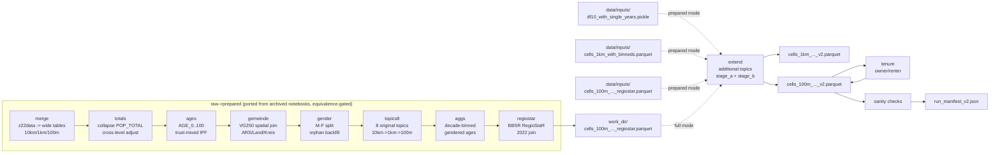

# cleancensus

Preparation and harmonization of the German **Zensus 2022 grid data** (100 m / 1 km / 10 km)
into consistent, analysis-ready cell tables — the spatial backbone for synthetic-population
generation (PopulationSim / eqasim).

<!-- TODO: add CI badge once a workflow is configured -->

**Paper:** Petre, F., Bienzeisler, L., Friedrich, B. (2026).
"A Framework for Harmonizing and Enriching Multi-Scale Census Grids: Application to Germany's 2022 Census Data."
*Procedia Computer Science*, 280, 965-970.
[doi:10.1016/j.procs.2026.04.122](https://doi.org/10.1016/j.procs.2026.04.122)

---

## The problem

The Zensus 2022 grid release applies cell-level disclosure control: each cell's category
counts are independently perturbed before publication.
As a result, the sum of categories within a cell does not equal the published cell total, and
the same universe measured at 100 m, 1 km, and 10 km resolution gives three inconsistent
values for the same spatial extent.
Any downstream model that ingests these tables raw will therefore work with contradictory
marginals, produce IPF infeasibilities, or silently accumulate rounding errors.
The following toy example illustrates the problem for a single cell:

| Column | Raw published value |
|---|---|
| Total households (`Insgesamt`) | 25 |
| 1-person households | 8 |
| 2-person households | 5 |
| 3-person households | 4 |
| 4-person households | 3 |
| 5-person households | 2 |
| Sum of categories | **22** |

`sum(categories) = 22 != 25 = Insgesamt` — the discrepancy is the disclosure perturbation.

---

## What the pipeline does

The pipeline has **eleven stages** spanning the full path from the raw Zensus 2022 grid data
to final analysis-ready cell tables.  Stages 1–8 ("raw→prepared") were ported from the
archived notebooks and are equivalence-gated against the notebook-era outputs.  Stages
9–11 are the harmonization and validation stages.

**Raw→prepared stages (ported from archived notebooks, equivalence-gated):**

1. **merge** — Download z22data Parquet files (Jonas Lieth's GitHub mirror) and assemble
   wide per-level tables at 10 km, 1 km, and 100 m; all 36 feature families fully mapped.
2. **totals** — Consensus-collapse the population total columns and proportionally adjust
   child sums to match parent totals across 10 km → 1 km → 100 m.
3. **ages** — Fit single-year age columns `AGE_0..AGE_100` via trust-mixed multiplicative
   IPF on the 10 km grid, then hierarchically downscale to 1 km and 100 m.
4. **gemeinde** — Spatial join of BKG VG250 Gemeinde polygons (EPSG:25832 → 3035) onto
   100 m cell centroids; attaches ARS-derived sub-fields (Land, Kreis, Gemeinde, …).
5. **gender** — Male/female age split at 100 m using GENESIS 1000A-2027 per-Gemeinde
   shares; orphan-cell backfill for 36 cells with population but no age breakdown.
6. **topics8** — Trust-blended IPF downscaling of the 8 original categorical topics
   (Familienstand, Energieträger, Heizungsart, HH-Größe, Lebensform, Räume, Wohnfläche,
   Geburtsland) from 10 km → 1 km → 100 m; orphan pass inline.
7. **aggs** — Decade-binned gendered age aggregates (`M_AGE_0_9_agg` … `F_AGE_80_plus_agg`)
   and undifferentiated `AGE_*_agg` columns; reconstructed from the canonical input file.
8. **regiostar** — Join 7 BBSR RegioStaR 2022 classification columns onto 100 m cells via
   8-digit AGS derived from the ARS key.

**Harmonization and validation stages:**

9. **extend** — Harmonize additional topics from the catalog at 10 km → 1 km → 100 m
   (trust-blended IPF, same machinery as topics8; controlled by `[harmonize].topics`).
10. **tenure** *(optional)* — Derive owner/renter household counts from `Eigentuemerquote`,
    anchored to the harmonized household total chain.
11. **sanity** — Invariant checks: `sum(categories) == *_adj` per cell, universe equality,
    national mass within 2 % of 10 km raw total, no NaN/negatives.



---

## Quickstart

```bash
# 0. Install uv (https://docs.astral.sh/uv/getting-started/installation/)
#    then clone this repo.

# 1. Install dependencies (Python >= 3.13 required)
uv sync

# 2. Copy and edit the example config
cp config.example.toml config.toml

# 3. Preview the resolved plan without running anything
uv run cleancensus --config config.toml --dry-run

# 4. Run
uv run cleancensus --config config.toml

# Use --help to see all options
uv run cleancensus --help
```

There are two entry modes, depending on what data you have available:

### (a) Prepared mode (default — fastest)

Place the three pre-processed input files in `data/inputs/` (see the **Data** section below
for file names and how to obtain them).  Only stages **extend**, **tenure**, and **sanity**
run — the raw→prepared chain is skipped.  This is the default behaviour and is exactly what
the config.example.toml enables.

**Hardware note:** the 100 m stage streams the 7.7 GB input in 1 M-row batches; peak RAM
~4–6 GB; a full national run with the default 2 topics + tenure takes approximately 2–4 h
on a desktop CPU.

### (b) Full mode (raw→final, stages 1–11)

Enable all stages in your config to run the complete pipeline starting from the raw
z22data Parquet files (downloaded automatically by the merge stage):

```toml
# config_full.toml — full raw->final pipeline
[data]
inputs_dir  = "data/inputs"
outputs_dir = "data/outputs"
version_tag = "v2"

[harmonize]
topics = ["Whg_Gebaeudetyp", "HH_Seniorenstatus"]
derived_tenure = true

[scope]
mode = "national"

[run]
sanity = "fail"
write_manifest = true

[stages]
merge     = true   # download z22data Parquet files + build wide tables
totals    = true   # collapse POP_TOTAL columns + cross-level adjustment
ages      = true   # AGE_0..100 via trust-mixed IPF
gemeinde  = true   # VG250 spatial join (needs BKG GeoPackage — see below)
gender    = true   # M/F split (needs GENESIS 1000A-2027 CSV — see below)
topics8   = true   # 8 original categorical topics 10km->1km->100m
aggs      = true   # decade-binned gendered age aggregates
regiostar = true   # BBSR RegioStaR 2022 join (needs regiostar_referenzdatei.xlsx)
extend    = true   # additional harmonized topics (catalog-driven)
```

**Two external files are required for the gemeinde and gender stages (not in z22data):**

| File | Where to get it | Config key |
|---|---|---|
| GENESIS table `1000A-2027_de.csv` (population by age and sex at Gemeinde level) | [ergebnisse.zensus2022.de/datenbank/online/table/1000A-2027](https://ergebnisse.zensus2022.de/datenbank/online/table/1000A-2027) → "Anpassen" → Gemeinden → download CSV | `gemeinde_age_csv_path` in `[stages]` TOML section |
| BKG VG250 GeoPackage (`DE_VG250.gpkg`, reference date 2022-01-01, EPSG:25832) | [gdz.bkg.bund.de](https://gdz.bkg.bund.de/index.php/default/open-data/verwaltungsgebiete-1-250-000-mit-einwohnerzahlen-stand-31-12-vg250-ew-31-12.html) | `vg250_gpkg_path` in `[stages]` TOML section |

**Note on 6 tables not in z22data:** age_avg, household_size_avg, rent_avg, owner_occupier,
dwelling_space, inhabitant_space are ratio/average columns available in z22data (ratio
features with cat=0 → direct download). Six topics present in the T: notebook-era merged
CSVs but **not** in z22data are: Seniorenstatus, Lebensform, Typ_HH_Familie, Religion,
Zahl_der_Staatsang., Grosse_Kernfamilie. These were z11-only and are documented in
`docs/Z22_GATE_REPORT.md`.

See [`docs/CONFIG.md`](docs/CONFIG.md) for the full `[stages]` reference.

Outputs land in `data/outputs/` (or wherever `outputs_dir` points):
- `cells_1km_with_binneds_<version_tag>.parquet`
- `cells_100m_with_gender_backf_binneds_happyorphans_with_aggs_regiostar_<version_tag>.parquet`
- `run_manifest_<version_tag>.json`

---

## Config quick-reference

Full documentation: [`docs/CONFIG.md`](docs/CONFIG.md).

| Section | Key | Type | Default | Effect |
|---|---|---|---|---|
| `[data]` | `inputs_dir` | string (path) | `"data/inputs"` | Directory containing the three canonical input files |
| `[data]` | `outputs_dir` | string (path) | `"data/outputs"` | Destination for versioned output files and the run manifest |
| `[data]` | `version_tag` | string | `"v2"` | Suffix appended to output file names |
| `[harmonize]` | `topics` | list of strings or `"all"` | *(see note)* | Explicit topic names to harmonize; mutually exclusive with `tiers` |
| `[harmonize]` | `tiers` | list of integers | *(see note)* | Topic tiers to include (1, 2, 3); mutually exclusive with `topics` |
| `[harmonize]` | `derived_tenure` | bool | `false` | Derive owner/renter counts from `Eigentuemerquote` |
| `[harmonize]` | `derived_vacancy` | bool | `false` | Derive occupied/vacant dwelling counts from `Leerstandsquote` (adds `BewohntWhg_*` + `LeerstehendWhg_*`; anchored to universe A) |
| `[scope]` | `mode` | `"national"` or `"subset"` | `"national"` | National run processes all cells; subset filters by ARS prefix |
| `[scope]` | `ars_prefixes` | list of strings | `[]` | Required when `mode = "subset"`; ARS-5 codes to include |
| `[run]` | `sanity` | `"fail"`, `"warn"`, or `"skip"` | `"fail"` | Invariant-check behaviour: fail aborts (exit 1), warn prints, skip omits |
| `[run]` | `write_manifest` | bool | `true` | Write `run_manifest_<version_tag>.json` on completion |

If neither `topics` nor `tiers` is specified, the pipeline uses the MiD-controllable default:
`["Whg_Gebaeudetyp", "HH_Seniorenstatus"]`.
MiD = Mobilität in Deutschland, the German national household travel survey (2023 edition).
The default topics are exactly those census attributes that the MiD household data can serve
as PopulationSim controls for: building type via the geocoded `haustyp` variable
(`Whg_Gebaeudetyp`) and senior status via household member ages (`HH_Seniorenstatus`).

---

## Validated reference results

### Stage gate summary

Each raw→prepared stage was validated against the notebook-era T: drive artifacts.
Cross-reference the gate reports in [`docs/`](docs/) for full details.

| Stage | Gate metric | Result | Report |
|---|---|---|---|
| **merge (z22)** | Shared columns: 157/158 exact at 10 km; 158/159 exact at 1 km | PASS | [`docs/Z22_GATE_REPORT.md`](docs/Z22_GATE_REPORT.md) |
| **merge (z22) — 1 orphan** | `households_0` at 10 km: −0.018 % (disclosure suppression); at 1 km: −13 % (cell-level suppression expected) | NEAR-EXACT / SYSTEMATIC (not a port bug) | same |
| **merge (z22) — Destatis supplement** | 33/33 columns EXACT at 10 km; 33/33 EXACT at 1 km; +14/14 columns for 7th table (`Typ_der_Kernfamilie_nach_Kindern`) | PASS | same |
| **totals** | 10 km exact; 1 km max\|d\| = 3.6e-12 | PASS | [`docs/AGES_GATE_REPORT.md`](docs/AGES_GATE_REPORT.md) |
| **ages** | 10 km exact; 1 km exact (212 k cells); 100 m exact (subset, 54 cells) | PASS | same |
| **gemeinde** | ARS sub-field transform verified on 100 unique ARS; T: artifact internal consistency confirmed (3,148,224 rows) | PASS | [`docs/GENDER_GATE_REPORT.md`](docs/GENDER_GATE_REPORT.md) |
| **gender** | Bavaria subset (575,875 rows): column sums relative diff < 2.4e-6 (float32 noise); backfill 36/36 rows exact | PASS | same |
| **topics8** | 1 km max\|d\| = 0; ZGB 78/82 exact + 1 benign orphan cell | PASS | (inline) |
| **aggs** | Gendered bins: exact zero diff; AGE_\* float noise ~1e-7 (M+F sum) | PASS | (inline) |
| **regiostar** | BBSR Gebietsstand 31.12.2022: null-rim 5,188 → 633 cells (−4,555); match rate ≥ 99.97 % vs BMDV2020 | PASS | same |
| **extend** | ZGB equivalence gate max\|d\| = 3.05e-05 (float32 noise); raw totals bit-exact | PASS | (inline) |
| **tenure** | National owner share 0.4419 (Zensus 2022 benchmark ≈ 0.436); 4 orphan cells deviate ≤ 3 HH (benign) | PASS | see below |
| **vacancy** | ZGB: 0 sanity failures; national signal rate 4.26 % (official Zensus 2022 ≈ 4.3 %); anchored to universe A | PASS | [`docs/Z22_GATE_REPORT.md`](docs/Z22_GATE_REPORT.md) |

### End-to-end output (extend + tenure + sanity)

The following numbers were produced by the validated national run
(topics = `["Whg_Gebaeudetyp", "HH_Seniorenstatus"]`, `derived_tenure = true`).
In the new pipeline a single run with `derived_tenure = true` produces what previously
required two runs (legacy v2 + v3).

| Metric | Value |
|---|---|
| 100 m output rows | 3,148,482 |
| Sanity failures | 0 |
| `sum(categories) == *_adj` per cell | exact (max \|d\| < 0.5) |
| `Seniorenstatus_adj == HH-Groesse_adj` per cell | exact |
| National mass relative deviation | 0.0001 |
| Raw-to-harmonized ratio range | 1.00 – 1.07 |
| National owner share (`Eigentuemerquote`) | 0.4419 (official Zensus 2022 ≈ 0.436) |
| 1 km cells filled from 10 km group mean (tenure) | 12,086 |
| 1 km cells filled from national mean (tenure) | 9 |
| 100 m no-signal cells filled from parent share | 471,752 |
| Orphan cells deviating > 0.5 HH from tenure anchor (max 3 HH) | 4 (benign, documented) |
| ZGB equivalence gate worst max\|d\| | 3.05e-05 (float32 noise) |
| ZGB raw totals vs legacy | bit-exact |

---

## Repository layout

| Path | Description |
|---|---|
| `cleancensus/config.py` | `Config` dataclass and `load_config()` — single contract for all pipeline parameters; `PRODUCER_STAGES` tuple |
| `cleancensus/pipeline.py` | Stage registry (`REGISTRY`), `plan()`, `run_pipeline()` — orchestrates all 11 stages |
| `cleancensus/z22.py` | `FEATURE_MAP` (160 entries, all 36 z22data features), `download_z22()`, `build_merged_table()`, `run_merge_z22()` |
| `cleancensus/ingest_totals.py` | Totals stage: `run_totals()` — consensus collapse of POP_TOTAL columns + proportional cross-level adjustment |
| `cleancensus/ages_stage.py` | Ages stage: `fit_single_years_10km()`, `downscale_single_years()`, `run_ages()` |
| `cleancensus/gemeinde_stage.py` | Gemeinde stage: spatial join of BKG VG250 polygons → ARS/Land/Kreis/… on 100 m cells |
| `cleancensus/gender_stage.py` | Gender stage: M/F split from GENESIS 1000A-2027 per-Gemeinde shares + orphan backfill |
| `cleancensus/topics8.py` | Topics8 stage: trust-blended IPF downscaling of 8 original categorical topics 10 km → 1 km → 100 m |
| `cleancensus/enrich.py` | Aggs stage (`run_aggs`) and RegioStaR stage (`run_regiostar`) |
| `cleancensus/harmonization.py` | Core machinery: `TrustBlend`, `rake_to_margins`, `make_child_totals_adj`, `TopicSpec`, `downscale_topic`, `normalize_parent_categories_for_specs`, `apply_adj_for_all_topics`, `impute_orphan_rows_100m` |
| `cleancensus/topics.py` | Topic catalog: `RAW_TOPICS` (14 topics in 3 tiers) and `MID_CONTROLLABLE_DEFAULT` |
| `cleancensus/stages.py` | `run_stage_a` (10 km → 1 km) and `run_stage_b` (1 km → 100 m, streamed) for the extend stage |
| `cleancensus/tenure.py` | `run_tenure` and `check_tenure` — owner/renter derivation |
| `cleancensus/vacancy.py` | `run_vacancy` and `check_vacancy` — occupied/vacant dwelling derivation from `Leerstandsquote` |
| `cleancensus/gemeinde_controls.py` | `build_gemeinde_controls()`, `run_gemeinde_controls()` — parse Regionaltabellen P2/P4 into Gemeinde-level control parquets |
| `cleancensus/sanity.py` | `run_sanity` — post-run invariant checks |
| `cleancensus/cli.py` | `main()` — CLI entry point (`uv run cleancensus`) with `--dry-run`, `--force`, `--from`, `--gemeinde-controls` flags |
| `tools/equivalence_zgb.py` | Cell-exact equivalence gate comparing two output parquet files |
| `notebooks_archive/` | Original notebook pipeline (preserved for provenance; see `notebooks_archive/ARCHIVE_README.md`) — fully superseded by pipeline stages |
| `docs/METHOD.md` | Mathematical method description |
| `docs/DATA.md` | Data dictionary, input files, work_dir intermediates, output naming |
| `docs/CONFIG.md` | Full configuration reference including `[stages]` block |
| `docs/Z22_GATE_REPORT.md` | z22data ingest validation: GITTER_ID formula, 10 km / 1 km gates, coverage completion |
| `docs/AGES_GATE_REPORT.md` | Totals and ages stage gate report |
| `docs/GENDER_GATE_REPORT.md` | Gemeinde and gender stage gate report |
| `docs/GEMEINDE_CONTROLS.md` | Gemeinde-level control tables: contents, category lists, MiD crosswalks, geography note, overspecification warning |
| `docs/RAW_DOWNLOAD.md` | How to download raw Zensus 2022 CSVs (z22data mirror + Destatis portal) |
| `tests/` | pytest suite (208+ tests, synthetic fixtures) |
| `data/` | Gitignored; `inputs/` (prepared files or outputs of stages 1–8), `outputs/` (final versioned files), `work/` (stage intermediates) |
| `config.example.toml` | Annotated example configuration |

---

## Data

### Raw source — the original Zensus 2022 grid

The pipeline starts from the **publicly available original Zensus 2022 grid data**
("Gitterdaten") and progressively smooths it into consistency — it adds no proprietary data.

The 2022 German census publishes results on the Europe-wide **INSPIRE grid**
(ETRS89-LAEA, EPSG:3035) at three nested resolutions — **100 m**, **1 km** and **10 km**
square cells, each with a stable id (e.g. `CRS3035RES100mN2691900E4341100`). Per cell it
reports population, household, building and dwelling attributes. Small counts are perturbed
and suppressed for privacy, which is precisely why category counts don't sum to the totals
and the levels disagree — the problem this pipeline fixes.

- **Default ingest (merge stage):** the `merge` stage downloads directly from the
  [z22data GitHub mirror](https://github.com/JsLth/z22data) by Jonas Lieth
  ([z22 R package](https://github.com/JsLth/z22)) — stable Parquet URLs, same dl-de/by-2-0
  licence, no portal navigation required. Enable with `[stages] merge = true` in your config.
  The merge stage also ingests a **Destatis-CSV supplement** (7 tables: Seniorenstatus,
  Lebensform, Familien-Typ, Religion, Zahl der Staatsangehörigkeiten, Größe der Kernfamilie,
  Typ der Kernfamilie nach Kindern) from `data/raw/destatis/`; all 33+14 columns gate EXACT
  against the notebook-era T: artifacts. See `docs/Z22_GATE_REPORT.md`.
- **RegioStaR reference:** the `regiostar` stage uses the **BBSR Referenz Gemeinden
  Gebietsstand 31.12.2022** workbook (auto-discovered in `data/raw/regiostar/`), reducing
  null-rim cells from 5,188 (BMDV Gebietsstand 2020) to 633 (−4,555 cells matched).
- **Manual alternative:** Zensus 2022 → *Gitterdaten zum Download für GIS* via
  [www.zensus2022.de](https://www.zensus2022.de) (*Ergebnisse → Gitterzellenbasierte
  Ergebnisse*; currently hosted on
  [Destatis](https://www.destatis.de/DE/Themen/Gesellschaft-Umwelt/Bevoelkerung/Zensus2022/Publikationen/))
  — ZIP archives of CSV tables for the 100 m / 1 km / 10 km grids.
- **Licence:** dl-de/by-2-0. **Attribution:** census content — *© Statistische Ämter des
  Bundes und der Länder, Zensus 2022*; grid geometry — *© GeoBasis-DE / BKG 2023*;
  z22data mirror — *Jonas Lieth / z22data*.

See [docs/DATA.md](docs/DATA.md) for the full grid explanation and column dictionary.

### Pipeline inputs (prepared mode)

In prepared mode the three files below go into `data/inputs/`.  They are **intermediates**
produced by the raw→prepared pipeline (stages 1–8 above), which is now fully implemented
and reproducible — the archived notebooks that originally produced them are superseded.

**To reproduce from scratch (full mode):** enable all stages in the config (see Quickstart
section (b) above); the pipeline downloads z22data automatically and runs the complete chain.
To obtain the prepared files directly, contact the authors (see [`CITATION.cff`](CITATION.cff));
publication on a data archive (e.g. Zenodo) is planned.

**Note on the z22data feature-name inversion (corrected):** z22data's `building_size` and
`dwelling_building_size` feature names are swapped relative to their literal meaning — a
translation mix-up in the upstream z22 project. The `FEATURE_MAP` maps them semantically
correctly (verified by the MFH_13+ discriminator); a regression test guards this direction.
See [`docs/Z22_GATE_REPORT.md`](docs/Z22_GATE_REPORT.md) for the full investigation.

| File | Shape | Content |
|---|---|---|
| `df10_with_single_years.pickle` | 3,824 × 346 | 10 km grid cells with merged Zensus topic tables and single-year age columns; produced by `notebooks_archive/data_prep.ipynb` + `ages.ipynb` |
| `cells_1km_with_binneds.parquet` | 212,758 × 256 | 1 km cells with previously harmonized 8-topic result and binned age/gender columns |
| `cells_100m_with_gender_backf_binneds_happyorphans_with_aggs_regiostar.parquet` | 3,148,482 × 570 | Full national 100 m cell table (~7.7 GB); all Germany; includes age/gender, aggregated topic columns, RegioStar classification, and the `is_orphan` flag |

**Suppression caveat:** `fillna(0)` is applied to all input frames.
A value of zero in a harmonized category column is therefore indistinguishable from a
disclosure-suppressed value that was rounded to zero.
The `Eigentuemerquote` (owner-occupancy rate) is a special case: it is never published as
zero for inhabited cells, so `Eigentuemerquote == 0` always means the value is missing.

---

## Method invariants

The following properties hold for every cell in the produced output (verified by `run_sanity`):

- `sum(categories) == Insgesamt_*_adj` per cell, per topic (max abs deviation < 0.5)
- Topics that share a universe (e.g. Gebaeude-type vs. Gebaeude-year) have identical `_adj` totals per cell
- National mass per topic is within 2 % of the corresponding 10 km raw total
- No NaN values and no negative values in produced category columns
- Owner + renter household counts equal the harmonized household total per cell

---

## Citation

If you use this software or the method it implements, please cite:

```bibtex
@article{petre2026framework,
  author    = {Petre, Flavius and Bienzeisler, Lasse and Friedrich, Bernhard},
  title     = {A Framework for Harmonizing and Enriching Multi-Scale Census Grids:
               Application to Germany's 2022 Census Data},
  journal   = {Procedia Computer Science},
  volume    = {280},
  pages     = {965--970},
  year      = {2026},
  doi       = {10.1016/j.procs.2026.04.122},
}
```

A `CITATION.cff` file is included for automated citation tooling.

---

## License

GPL-3.0-or-later — see [`LICENSE`](LICENSE).
