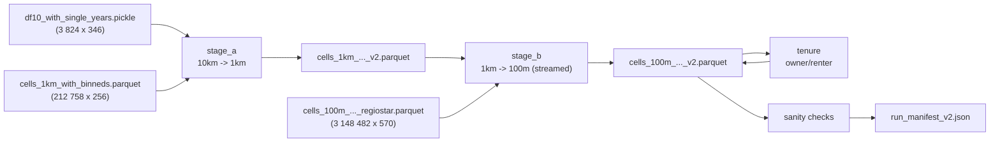

# cleancensus

Preparation and harmonization of the German **Zensus 2022 grid data** (100 m / 1 km / 10 km)
into consistent, analysis-ready cell tables — the spatial backbone for synthetic-population
generation (PopulationSim / eqasim).

<!-- TODO: add CI badge once a workflow is configured -->

**Paper:** Petre, F., Bienzeisler, L., Friedrich, B. (2026).
"A Framework for Harmonizing and Enriching Multi-Scale Census Grids: Application to Germany's 2022 Census Data."
*Procedia Computer Science*, 280, 965-970.
[doi:10.1016/j.procs.2026.04.122](https://doi.org/10.1016/j.procs.2026.04.122)

---

## The problem

The Zensus 2022 grid release applies cell-level disclosure control: each cell's category
counts are independently perturbed before publication.
As a result, the sum of categories within a cell does not equal the published cell total, and
the same universe measured at 100 m, 1 km, and 10 km resolution gives three inconsistent
values for the same spatial extent.
Any downstream model that ingests these tables raw will therefore work with contradictory
marginals, produce IPF infeasibilities, or silently accumulate rounding errors.
The following toy example illustrates the problem for a single cell:

| Column | Raw published value |
|---|---|
| Total households (`Insgesamt`) | 25 |
| 1-person households | 8 |
| 2-person households | 5 |
| 3-person households | 4 |
| 4-person households | 3 |
| 5-person households | 2 |
| Sum of categories | **22** |

`sum(categories) = 22 != 25 = Insgesamt` — the discrepancy is the disclosure perturbation.

---

## What the pipeline does

The pipeline resolves the cross-level inconsistencies and category-total mismatch for every
cell in Germany in five sequential stages:

1. **stage_a** — Downscale 10 km category vectors to 1 km, using trust-blended IPF anchored to
   the 10 km parent totals; produces adjusted totals (`*_adj`) and harmonized category columns.
2. **stage_b** — Downscale 1 km category vectors to 100 m over the full 3.1 M-cell national
   grid, streamed in batches to avoid memory exhaustion; orphan 100 m cells (no 1 km parent)
   receive prior-based imputation.
3. **tenure** *(optional)* — Derive owner/renter household counts from the published
   `Eigentuemerquote` ratio, anchored to the harmonized household total chain.
4. **sanity** — Run invariant checks: `sum(categories) == *_adj` per cell, universe equality
   across co-anchored topics, national mass within 2 % of the 10 km raw total, no NaN/negatives.
5. **manifest** — Write a JSON run manifest with timings, git SHA, config snapshot, and output
   file sizes.



---

## Quickstart

```bash
# 0. Install uv (https://docs.astral.sh/uv/getting-started/installation/)
#    then clone this repo.

# 1. Install dependencies (Python >= 3.13 required)
uv sync

# 2. Place the three input files in data/inputs/
#    (see the Data section below for file names and how to obtain them)

# 3. Copy and edit the config
cp config.example.toml config.toml
#    Edit: inputs_dir, outputs_dir, version_tag, topics, derived_tenure, mode

# 4. Preview the resolved plan without running anything
uv run cleancensus --config config.toml --dry-run

# 5. Run the full pipeline
uv run cleancensus --config config.toml

# Use --help to see all options
uv run cleancensus --help
```

**Hardware note:** the 100 m stage streams the 7.7 GB input in 1 M-row batches; peak RAM
~4–6 GB; a full national run with the default 2 topics + tenure takes approximately 2–4 h
on a desktop CPU.

Outputs land in `data/outputs/` (or wherever `outputs_dir` points):
- `cells_1km_with_binneds_<version_tag>.parquet`
- `cells_100m_with_gender_backf_binneds_happyorphans_with_aggs_regiostar_<version_tag>.parquet`
- `run_manifest_<version_tag>.json`

---

## Config quick-reference

Full documentation: [`docs/CONFIG.md`](docs/CONFIG.md).

| Section | Key | Type | Default | Effect |
|---|---|---|---|---|
| `[data]` | `inputs_dir` | string (path) | `"data/inputs"` | Directory containing the three canonical input files |
| `[data]` | `outputs_dir` | string (path) | `"data/outputs"` | Destination for versioned output files and the run manifest |
| `[data]` | `version_tag` | string | `"v2"` | Suffix appended to output file names |
| `[harmonize]` | `topics` | list of strings or `"all"` | *(see note)* | Explicit topic names to harmonize; mutually exclusive with `tiers` |
| `[harmonize]` | `tiers` | list of integers | *(see note)* | Topic tiers to include (1, 2, 3); mutually exclusive with `topics` |
| `[harmonize]` | `derived_tenure` | bool | `false` | Derive owner/renter counts from `Eigentuemerquote` |
| `[scope]` | `mode` | `"national"` or `"subset"` | `"national"` | National run processes all cells; subset filters by ARS prefix |
| `[scope]` | `ars_prefixes` | list of strings | `[]` | Required when `mode = "subset"`; ARS-5 codes to include |
| `[run]` | `sanity` | `"fail"`, `"warn"`, or `"skip"` | `"fail"` | Invariant-check behaviour: fail aborts (exit 1), warn prints, skip omits |
| `[run]` | `write_manifest` | bool | `true` | Write `run_manifest_<version_tag>.json` on completion |

If neither `topics` nor `tiers` is specified, the pipeline uses the MiD-controllable default:
`["Whg_Gebaeudetyp", "HH_Seniorenstatus"]`.
MiD = Mobilität in Deutschland, the German national household travel survey (2023 edition).
The default topics are exactly those census attributes that the MiD household data can serve
as PopulationSim controls for: building type via the geocoded `haustyp` variable
(`Whg_Gebaeudetyp`) and senior status via household member ages (`HH_Seniorenstatus`).

---

## Validated reference results

The following numbers were produced by the validated national run
(legacy v2+v3 artifacts: v2 = topic harmonization, v3 = v2 + tenure;
in the new pipeline a single run with `derived_tenure = true` produces both in one `version_tag`)
with `topics = ["Whg_Gebaeudetyp", "HH_Seniorenstatus"]` and `derived_tenure = true`.
Use them as a sanity check when reproducing the results.

| Metric | Value |
|---|---|
| 100 m output rows | 3,148,482 |
| Sanity failures | 0 |
| `sum(categories) == *_adj` per cell | exact (max \|d\| < 0.5) |
| `Seniorenstatus_adj == HH-Groesse_adj` per cell | exact |
| National mass relative deviation | 0.0001 |
| Raw-to-harmonized ratio range | 1.00 – 1.07 |
| National owner share (`Eigentuemerquote`) | 0.4419 (official Zensus 2022 ≈ 0.436) |
| 1 km cells filled from 10 km group mean (tenure) | 12,086 |
| 1 km cells filled from national mean (tenure) | 9 |
| 100 m no-signal cells filled from parent share | 471,752 |
| Orphan cells deviating > 0.5 HH from tenure anchor (max 3 HH) | 4 (benign, documented) |
| ZGB equivalence gate worst max\|d\| | 3.05e-05 (float32 noise) |
| ZGB raw totals vs legacy | bit-exact |

---

## Repository layout

| Path | Description |
|---|---|
| `cleancensus/config.py` | `Config` dataclass and `load_config()` — single contract for all pipeline parameters |
| `cleancensus/harmonization.py` | Core machinery: `TrustBlend`, `rake_to_margins`, `make_child_totals_adj`, `TopicSpec`, `downscale_topic`, `normalize_parent_categories_for_specs`, `apply_adj_for_all_topics`, `impute_orphan_rows_100m` |
| `cleancensus/topics.py` | Topic catalog: `RAW_TOPICS` (14 topics in 3 tiers) and `MID_CONTROLLABLE_DEFAULT` |
| `cleancensus/stages.py` | `run_stage_a` (10 km → 1 km) and `run_stage_b` (1 km → 100 m, streamed) |
| `cleancensus/tenure.py` | `run_tenure` and `check_tenure` — owner/renter derivation |
| `cleancensus/sanity.py` | `run_sanity` — post-run invariant checks |
| `cleancensus/cli.py` | `main()` — CLI entry point (`uv run cleancensus`) |
| `tools/equivalence_zgb.py` | Cell-exact equivalence gate comparing two output parquet files |
| `notebooks_archive/` | Original notebook pipeline (preserved for provenance; see `notebooks_archive/ARCHIVE_README.md`) |
| `docs/` | `METHOD.md`, `DATA.md`, `CONFIG.md` |
| `tests/` | pytest suite (23 tests, synthetic fixtures) |
| `data/` | Gitignored; contains `inputs/` and `outputs/` locally |
| `config.example.toml` | Annotated example configuration |

---

## Data

### Raw source

The ultimate source is the **Zensus 2022 grid data** published by the Statistische Ämter des
Bundes und der Länder under the **dl-de/by-2-0** licence.
Download the "Ergebnisse auf Gitterzellenebene" CSVs from
[www.zensus2022.de](https://www.zensus2022.de).
Attribution required: *Datenquelle: Statistische Ämter des Bundes und der Länder, Zensus 2022*.

### Pipeline inputs (derived intermediates)

The three files consumed by cleancensus are **NOT** the raw Zensus CSVs — they are derived
artifacts produced by running the archived notebooks on those raw CSVs, in this order:

1. `notebooks_archive/data_prep.ipynb` — merges raw topic tables, builds 10 km pickle
2. `notebooks_archive/ages.ipynb` — adds single-year age columns
3. `notebooks_archive/gender.ipynb` — adds gender split columns at 100 m
4. `notebooks_archive/other_binned_data.ipynb` — adds remaining binned topic columns

These multi-hour notebook runs are the only way to reproduce the inputs from scratch.
**The derived input files are not publicly hosted yet.**
To reproduce from scratch, run the archived notebooks on the raw grid CSVs.
To obtain the prepared files directly, contact the authors (see `CITATION.cff`).
*(Archival on Zenodo is planned as future work.)*

Place the three derived files in `data/inputs/` before running the pipeline.

| File | Shape | Content |
|---|---|---|
| `df10_with_single_years.pickle` | 3,824 × 346 | 10 km grid cells with merged Zensus topic tables and single-year age columns; produced by `notebooks_archive/data_prep.ipynb` + `ages.ipynb` |
| `cells_1km_with_binneds.parquet` | 212,758 × 256 | 1 km cells with previously harmonized 8-topic result and binned age/gender columns |
| `cells_100m_with_gender_backf_binneds_happyorphans_with_aggs_regiostar.parquet` | 3,148,482 × 570 | Full national 100 m cell table (~7.7 GB); all Germany; includes age/gender, aggregated topic columns, RegioStar classification, and the `is_orphan` flag |

**Suppression caveat:** `fillna(0)` is applied to all input frames.
A value of zero in a harmonized category column is therefore indistinguishable from a
disclosure-suppressed value that was rounded to zero.
The `Eigentuemerquote` (owner-occupancy rate) is a special case: it is never published as
zero for inhabited cells, so `Eigentuemerquote == 0` always means the value is missing.

---

## Method invariants

The following properties hold for every cell in the produced output (verified by `run_sanity`):

- `sum(categories) == Insgesamt_*_adj` per cell, per topic (max abs deviation < 0.5)
- Topics that share a universe (e.g. Gebaeude-type vs. Gebaeude-year) have identical `_adj` totals per cell
- National mass per topic is within 2 % of the corresponding 10 km raw total
- No NaN values and no negative values in produced category columns
- Owner + renter household counts equal the harmonized household total per cell

---

## Citation

If you use this software or the method it implements, please cite:

```bibtex
@article{petre2026framework,
  author    = {Petre, Flavius and Bienzeisler, Lasse and Friedrich, Bernhard},
  title     = {A Framework for Harmonizing and Enriching Multi-Scale Census Grids:
               Application to Germany's 2022 Census Data},
  journal   = {Procedia Computer Science},
  volume    = {280},
  pages     = {965--970},
  year      = {2026},
  doi       = {10.1016/j.procs.2026.04.122},
}
```

A `CITATION.cff` file is included for automated citation tooling.

---

## License

GPL-3.0-or-later — see [`LICENSE`](LICENSE).
