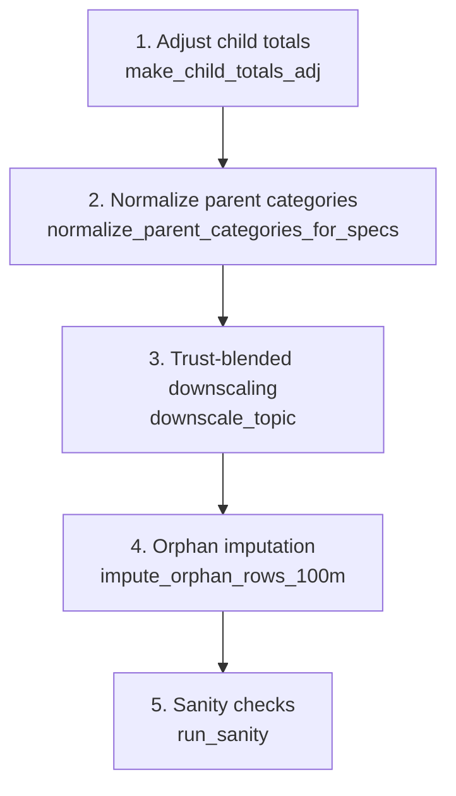

# Method Reference

This document describes the cleancensus harmonization algorithm step by step.
For the scientific justification and empirical validation, see the paper:

> Petre, F., Bienzeisler, L., Friedrich, B. (2026). "A Framework for Harmonizing and
> Enriching Multi-Scale Census Grids: Application to Germany's 2022 Census Data."
> *Procedia Computer Science*, 280, 965-970.
> [doi:10.1016/j.procs.2026.04.122](https://doi.org/10.1016/j.procs.2026.04.122)

---

## Overview

The algorithm operates topic-by-topic and level-by-level (10 km → 1 km, then 1 km → 100 m).
For each (parent, child) level pair the same five-step procedure applies:



Steps 1–3 run once per topic per level inside `apply_adj_for_all_topics` + `downscale_topic`.
Step 4 is a post-pass only at the 100 m level.
Step 5 runs after all topics are complete.

---

## 1. Total adjustment (`make_child_totals_adj`)

**Goal:** make the sum of child-level totals equal the parent-level adjusted total.

For each parent cell `k` with adjusted total `T_k` and children `i ∈ k`:

```
scale_k = T_k / sum_i( Insgesamt_i )
Insgesamt_i_adj = scale_k * Insgesamt_i   for all i in k
```

The scaled totals are written as a new `*_adj` column in the child frame and become
the hard row margins for the downscaling step.

**Degenerate case:** if all children in a group have `Insgesamt == 0` but `T_k > 0`,
the adjustment splits `T_k` equally across the group's children (one value per child,
proportional to the count of children, not to any signal).

**Invariant:** `sum_{i in k}( Insgesamt_i_adj ) == T_k` for every parent group `k`.

---

## 2. Parent normalization (`normalize_parent_categories_for_specs`)

**Why it is needed:** the raw 10 km category values are also perturbed — their row sum
may differ from the 10 km total. If the parent's categories do not add up to the parent
total, the column targets passed to the raking step are infeasible.

For each topic, `normalize_parent_categories_for_specs` rescales the parent category
matrix in-place so that each parent row sums to its total:

```
f_i = T_i / sum_k( cat_ik )    (scale factor, row i)
cat_ik_norm = f_i * cat_ik
```

**Prior injection:** if a parent row has `sum(cats) == 0` but `T > 0` (no category
signal at all), the global distribution of that topic computed over all parent rows
is injected as a prior:

```
cat_ik_norm = T_i * prior_k
prior_k = sum_i( cat_ik ) / sum_ik( cat_ik )    (normalized global share)
```

**Invariant:** after normalization, `sum_k( cat_ik ) == T_i` for every parent row `i`
with `T_i > 0`.

---

## 3. Trust-blended downscaling (`downscale_topic`)

This is the core of the algorithm.
Given parent category totals `p_k` (already normalized) and child row totals `t_i` (adjusted),
the algorithm estimates a child category matrix `X` with shape `(n_children, K)`.

### Initialization

```
X_ik = t_i * (p_k / sum_k p_k)    (outer product of row totals and parent shares)
```

This is the purely proportional starting point: every child gets the parent's category
distribution, scaled to its own total.

### Trust-blended update

For each category `k` and each child row `i`, a trust weight `w_i` is computed from
the child total `t_i`:

```
cutoff = t_pc * K                       (t_pc = 5.0, K = number of categories)
w_i = w_min + (1 - w_min) * min(1, t_i / cutoff)
```

With default parameters (`w_min = 0.40`, `t_pc = 5.0`):
- A cell with 0 households gets `w = 0.40` (40 % local trust).
- A cell with `5 * K` or more households gets `w = 1.00` (full local trust).

**Intuition:** small cells contain too few observations to be reliable estimators of
the true category distribution, so they are partially pulled toward the parent distribution.
Large cells, on the other hand, have enough counts that their own observed distribution
is trusted more strongly.

For each category `k`, a blended target is formed:

```
target_ik = w_i * local_ik + (1 - w_i) * (p_k / sum p) * t_i
```

where `local_ik` is the raw published category value for child `i`, category `k`.

The current estimate `X[:, k]` is then nudged toward `target_ik` with damping factor
`alpha` (default 0.85 or 0.90 depending on topic):

```
f_ik = (target_ik / X_ik) ** alpha
X_ik *= f_ik
```

After each category update, rows are re-projected to exactly satisfy `sum_k X_ik = t_i`.

### Inner and outer iterations

The blended update + row re-projection is repeated `inner_passes = 10` times per outer
iteration. After each block of inner passes, a hard `rake_to_margins` (IPF) call enforces
both the row targets `t_i` and the column targets `p_k` simultaneously.
The outer loop runs `outer_iters = 2` times.

### Hard raking (`rake_to_margins`)

Standard iterative proportional fitting over the 2-D matrix `X`:

1. Scale every column so `X.sum(axis=0) == p`.
2. Scale every row so `X.sum(axis=1) == t`.
3. Repeat until `max(|residual|) < tol = 1e-11` (up to 1,000 iterations).

A small "support seed" (`seed_eps = 1e-15`) is added to zero cells where both the row
target and column target are positive, to prevent IPF from getting stuck at zero.

After raking, any column that was zero in the parent (i.e. `p_k == 0`) is forced back to
zero.

**Invariant:** after `downscale_topic`, `X.sum(axis=1) == t_i` exactly (row totals met)
and `X.sum(axis=0) ≈ p_k` (column targets met to within rounding; validated to < 0.01 abs).

---

## 4. Orphan imputation (`impute_orphan_rows_100m`)

A 100 m cell is an **orphan** if its `GITTER_ID_1km` does not appear in the 1 km result
frame (i.e. there is no 1 km parent to anchor against).

For each topic, orphan rows are classified into three cases:

| Case | Condition | Action |
|---|---|---|
| A | `sum(categories) > 0` and `*_adj > 0` | Scale the raw category signal to the adjusted total |
| B | `sum(categories) == 0` and `*_adj > 0` | Allocate using a prior built from non-orphan 100 m category sums |
| Z | `*_adj == 0` | Set all categories to zero |

**Prior for case B:**

```
prior_k = sum_{non-orphans}( cat_k ) / sum_{k, non-orphans}( cat_k )
X_ik = t_i * prior_k
```

**Invariant:** after imputation, `sum_k X_ik = t_i` for cases A and B; zero for case Z.

---

## 5. Tenure derivation

The `Eigentuemerquote` (owner-occupancy rate) is published as a percentage in the
100 m and 1 km grid files.

### Quote semantics

The owner-occupancy rate is **never published as 0** for inhabited cells in the Zensus
2022 release. Therefore:

```
Eigentuemerquote == 0  <=>  value is missing (disclosure suppression or no signal)
```

This is a specific exception to the general `fillna(0)` convention.

### 1 km parent build

For cells where the quote is present (`q > 0`) and households exist (`hh > 0`):

```
EigentuemerHH_1km = q / 100 * HH_adj
MieterHH_1km      = HH_adj - EigentuemerHH_1km
```

For cells where the quote is missing (`q == 0`) but `hh > 0`, the quote is filled
from the HH-weighted mean of the cell's 10 km parent group:

```
q_group = sum_{cells in group with q>0}( q * hh ) / sum_{cells in group with q>0}( hh )
```

As a last resort (no cells in the group have a quote), the national HH-weighted mean is used.

In the national v2 run: 12,086 cells were filled from the 10 km group mean, 9 from the
national mean.

### 100 m downscaling

The two tenure columns at 100 m are derived from the 100 m `Eigentuemerquote` where
available, with 1 km parent totals used as the downscaling target via the same
`downscale_topic` mechanism.
Cells with no local quote signal receive their allocation purely from the 1 km parent shares.

In the national v2 run, 471,752 cells had no local 100 m quote and were filled from parent
shares.

### Universe and anchor

Tenure is anchored to `Insgesamt_Haushalte_Groesse_des_privaten_Haushalts_*_adj`
(the harmonized household total).
This is the same anchor as `HH_Seniorenstatus`; the equality
`EigentuemerHH + MieterHH == HH_adj == Seniorenstatus_adj` is checked by `run_sanity`.

The 4 orphan cells where `|owner + renter - Seniorenstatus_adj| > 0.5` are a known
benign artifact (they deviate by at most 3 households) and are reported as INFO, not
as failures.

**Invariant:** for non-orphan cells, `EigentuemerHH + MieterHH == HH_adj` exactly
(max abs deviation < 0.5).

---

## 6. Universe table

Different topics count different objects.
Cross-universe comparisons or cross-universe raking are invalid.

| Universe | Sum (national) | Example topics |
|---|---|---|
| Personen (population) | ~82.7 M (`POP_TOTAL_adj`) | Familienstand, Geburtsland, Staatsangehoerigkeit, Religion |
| Haushalte | ~40.2 M | Haushaltsgroesse, Lebensform, Seniorenstatus, Familientyp, Tenure |
| Familien | own totals | Fam_Groesse, Fam_TypNachKindern |
| Gebaeude | 19.1 M | Geb_Gebaeudetyp, Geb_AnzahlWohnungen, Geb_Baujahr, Geb_Energietraeger |
| Wohnungen A (Raeume/Flaeche) | 41.2 M | Raeume, Wohnflaeche |
| Wohnungen B (Gebaeudetyp/Heizungsart) | 42.5 M | Whg_Gebaeudetyp, Whg_Heizungsart |

Note: Wohnungen A and Wohnungen B count dwellings by different attributes and have different
universes (42.5 M vs 41.2 M); they must never be mixed as anchors for each other.

**Invariant:** within each universe, all topics sharing that universe have identical
`*_adj` totals per cell.
